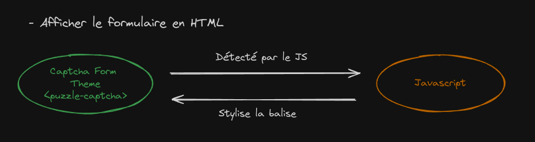
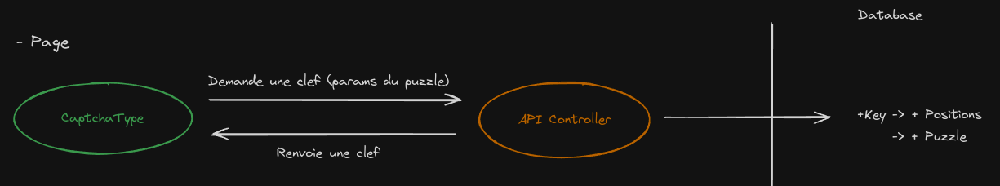
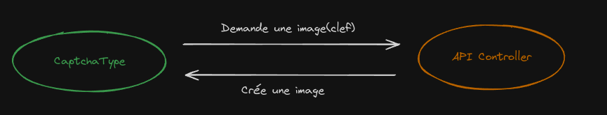
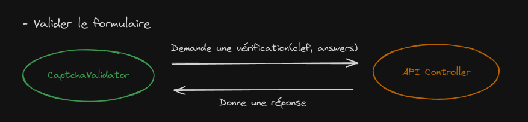

# Le puzzle anti-bot

## But :
Le but de ce captcha est de générer jusqu'à 3 pièces de puzzle différentes sur une image et d'inviter l'utilisateur à reconstruire le puzzle pour s'assurer qu'il est humain.
Cette solution sera proposée en SaaS et devra pouvoir être intégré dans un module Drupal.

## Fonctionnement : 

### Côté client : 
    - Le captchaType (field rattaché à un formulaire)
    - Le captchaValidator (valide le captcha)
    - Le thème du captcha (html)

### Côté serveur :
    - Le Controller de l'API
    - Le Javascript qui va styliser l'html du captcha côté client

### Configuration :
**1. Ajout d'un champ captcha à un formulaire** 
```php
->add('captcha', CaptchaType::class, [
      'mapped' => false,
])
```

**2. Configurer les options du captcha dans le CaptchaType**
```php
// CaptchaType.php
$puzzleOptions = [
    'imageWidth' => 350,
    'imageHeight' => 200,
    'pieceWidth' => 50,
    'pieceHeight' => 50,
    'piecesNumber' => 3,
    'puzzleBar' => 'bottom',
    'spaceBetweenPieces' => 50,
    'precision' => 10
];     
``` 

**3. Ajouter le thème du captcha**

- twig.yaml
```yaml
twig:
    form_themes:
        - 'captcha/form.html.twig'
    file_name_pattern: '*.twig'
```

- captcha/form.html.twig (automatique)
```twig

<puzzle-captcha 
    
        {{ ( " " ~ attrname ~ "=\"" ~ attrvalue ~ "\"" )|raw('html') }}
    
>
    <div class="captcha-image"></div>

    <div class="captcha-pieces-container">    
        
            {{ form_widget(child) }}
        
    </div>
</puzzle-captcha>

```



### Le captcha 

1. À la génération du formulaire, une requête est envoyée vers l'API pour générer une clef avec les paramètres du formulaire
2. L'API va générer une clef avec un unique UID, créer des positions pour le puzzle et enregistrer les données dans la base de données (Key, Positions, Puzzle)  

3. Le formulaire va avoir besoin d'une image pour le Captcha et donc une image sera créée grâce à l'API et à la clef. Les informations des positions du Captcha seront retrouvés dans la base de données.

4. Pour la vérification, le validator demandera à l'API si le captcha est valide ou non. 


